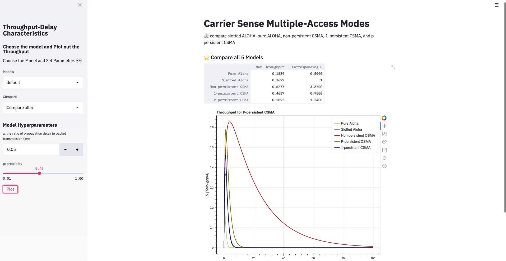
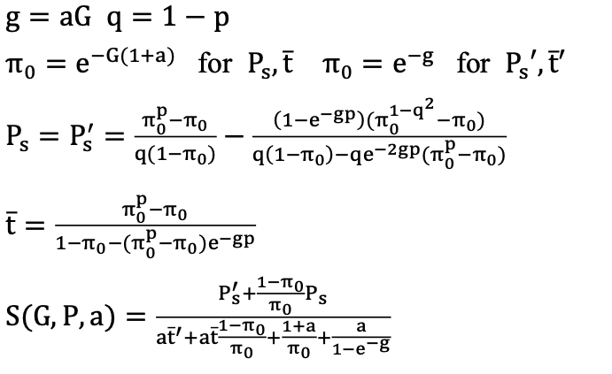

# ProtocolThroughput

### Intro
This is a streamlit python web app. User can plot to compare the 
theoretical throughputs of slotted ALOHA, pure ALOHA, non- persistent CSMA, 1-persistent CSMA, and p-persistent CSMA.

### file 
Directory AlohaProtocal and CSMAProtocol implements the calculation methods.
Compare.py, Plot.py and PlotMax.py are Plot functions.
Run app.py to see the web.
 
### Methods
User can set up value p and a.
S: Throughput (The probability of successful transmission of the data frame) S = G ∗ Ps
G: Offered Load rate (traffic rate: Expected total frames presented to the link per the transmission time of a single frame)
a : The ratio of propagation delay to packet transmission time. As CSMA relies on the sender sensing the state of the transmission channel,
it can therefore only be effectively used in channels which have short propagation delays. 
(1) Slotted ALOHA
The user has to wait till the next time slot start, to transmit the data frame.
S = Ge−G
(2) Pure ALOHA
The user can transmit data frame whenever the station has the data to be transmitted. S = Ge−2G
(3) Non-persistent CSMA
When a transmitting station has a frame to send and it senses a busy channel, it waits for a random period of time without sensing the channel in the interim, and repeats the algorithm.
S = Ge−aG G(1+2a)+e−2aG
(4) 1-persistent CSMA
When transmitting station has a frame to send and it senses a busy channel, it waits for the end of the
transmission, and transmits immediately. Hence, it sends with a probability 1.
S = G[1+G+aG(1+G+aG/2)]e−G(1+2a) G(1+2a)−(1−e−aG)+(1+aG)e−G(1+a)
(5) p-persistent CSMA
When transmitting station has a frame to send and it senses a busy channel, 
it waits for the end of the transmission, and transmits with a probability p.


### Demo
```console
foo@bar:~$ pip install streamlit
```
```console
foo@bar:~$ streamlit run app.py
```

### Conclusion
(1) Compare Pure ALOHA and Slotted ALOHA
Pure ALOHA has the highest collision probability. The maximum throughput occurs at G = 1/2 which is 18.4%. 
Slotted ALOHA has better throughput than Pure ALOHA. 
The maximum throughput occurs at G =1 which is 36.8%.
(2) Compare ALOHA and CSMA
CSMA is used to improve performance, avoid transmissions that are certain to cause collisions. In general, CSMA outperforms ALOHA. 
Under heavy load conditions, specifically when G > 10 (in Fig.1), the throughput of Pure ALOHA, Slotted ALOHA and 1-persistent CSMA almost reaches 0. 
But p-Persistent CSMA and non-Persistent CSMA can have relative higher throughput until G = 100.
(3) Compare p-Persistent CSMA and non-Persistent CSMA
When a = 0.05, if p = 0.01, the maximum throughput of non-Persistent CSMA is higher than p-Persistent CSMA.
If p = 0.09, the maximum throughput of p-Persistent CSMA is better higher than non-Persistent CSMA.
To make p-Persistent CSMA has a better performance, we need to set probability of retransmission higher.
To conclude, we use maximum throughput to rank the performance of 5 models:
p-Persistent CSMA ≈ non-Persistent CSMA > 1-persistent CSMA > Slotted ALOHA > Pure ALOHA.
[](https://youtu.be/LYloJ2HxejE)
